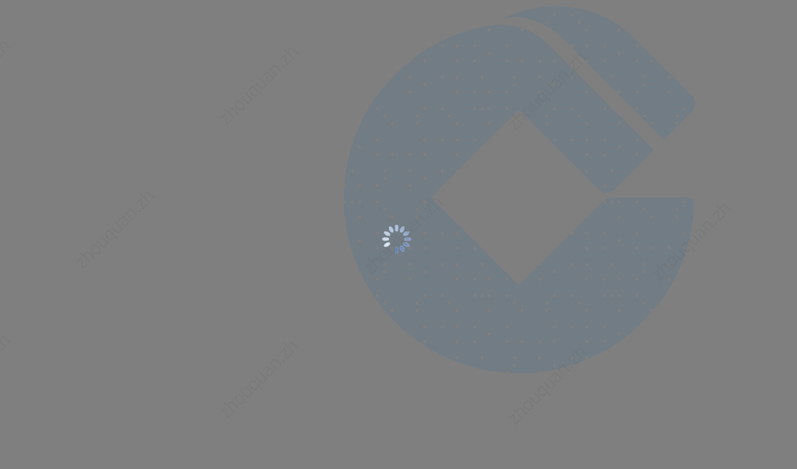

# @yqcoder_components

> 注意: &emsp;请选择无视截图水印

## 1.&emsp;安装、引用依赖

1.1 &emsp;安装依赖

```node
npm install @yqcoder/components
```

1.2 &emsp;main.js引用依赖

```js
import yqComponent from "@yqcoder/components";
Vue.use(yqComponent);
```

## 2.&emsp;组件列表

2.1 &emsp;[加载中](#loading)
2.2 &emsp;[百分比进度条](#percentage)

## 3.&emsp;组件demo

3.1 &emsp;<a id='loading'>加载中</a>

3.1.1 &emsp;效果图 



3.1.2 &emsp;组件使用

```js
// loading: 判断是否显示加载中, true:显示, false:隐藏, 默认为false
// rem: 是否使用rem单位, true:是, false: 否, 默认为false

<loading :loading='true' :rem='true'></loading>
```

3.2 &emsp;<a id='percentage'>百分比进度条</a>

3.2.1 &emsp;效果图 


3.2.2 &emsp;百分比进度条

```js
// width: 进度条百分比, 0%-100%, 默认为50%
// background: 进度条颜色左到右['', ''], 默认为["#002adb", "#04f7fb"]
// haveBg: 是否显示黑色背景, true:是, false: 否, 默认为true

<percentage width='70%' :background='["#002adb", "#04f7fb"]' :haveBg='false'></percentage>
```